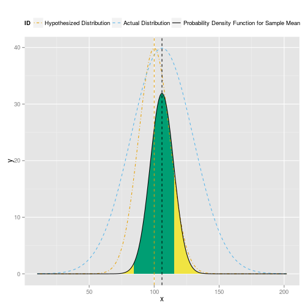

Interactive Statistics Lessons
========================================================
author: Yilmaz Rona
date: 3/6/2016

Basic Concept
========================================================

The basic concepts of statistics can be very difficult for students to initially grasp.  
- Calculations are overwhelming and intricate.
- Pages in textbook are static.

To counter this, we propose to produce dynamic 'textbooks'
- Lessons encoded in web applications.
- Dynamic
- Student observes how changes to parameters or data affect results.
- Student gets to learn via 'playing'.

Prototype Example
========================================================

Application provides an introductory lesson to Hypothesis testing.
https://yrona.shinyapps.io/project/
- Appropriate for introductory course.
- Students are able to observe the impact of modifying parameters for
  - Expected population distribution i.e. what we think the population is
  - Actual population distribution i.e. the reality
  - The sample size and the confidence value
- The application graphically and textually describes the probability of rejecting or retaining the null hypothesis and how likely it is to come to the right conclusion.

Prototype Example - How to use it
========================================================
1. Select the scenario you desire: 
  $\mu<\mu_0$; $\mu>\mu_0$; or $\mu\neq\mu_0$
2. Experiment with altering the mean of either the sample population or the actual population
3. A plot will display the a probability distribution function for the mean of samples.
4. The green area on the plot represents where the null hypothesis would be retained.  The yellow where it would be rejected.
5. An explanation describes the outcome textually.

Prototype Example - Sample Output
========================================================

 
***
Under this scenario, if you were to take a sample of  7 observations, 14.8% of the time you would observe a sample mean less than or equal to  84.2 or greater than or equal to  116 .  Therefore, you would conclude 14.8% of the time that the mean differed significantly from 100 and would conclude 85.2% of the time that the mean was was approximately equal to it.

Additional Work Required 
========================================================
(forbidden slide #6)
- Prototype could be made less complex or abstract
- Prototype has bugs 
  - MathJax failing to load when the web app is hosted at shinyapps.io.
  - Number outputs in results printout are poorly formated, particularly when percentages are near 100%.
- A series of web applications should be created, with each teaching a different concept.
- A system to navigate from one lesson to another is very much needed.
